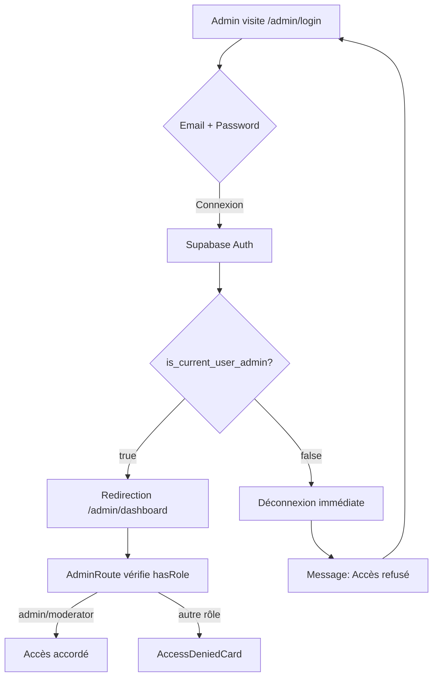

# 🔒 Système de Sécurité Admin - Bikawo

## Vue d'ensemble

Bikawo utilise un système de rôles multi-niveaux avec protection **Row Level Security (RLS)** côté base de données, garantissant une sécurité maximale pour l'accès administrateur.

## Architecture de Sécurité

```
┌─────────────────────────────────────────────┐
│  Interface utilisateur (React)              │
│  - /admin/login (page dédiée)               │
│  - AdminRoute (protection frontend)         │
└──────────────┬──────────────────────────────┘
               │
               ▼
┌─────────────────────────────────────────────┐
│  Authentification Supabase Auth             │
│  - Email/Password                           │
│  - JWT tokens                               │
└──────────────┬──────────────────────────────┘
               │
               ▼
┌─────────────────────────────────────────────┐
│  Vérification des rôles (RLS)               │
│  - Fonction: is_current_user_admin()        │
│  - Table: user_roles                        │
│  - Enum: app_role (admin, client, etc.)    │
└──────────────┬──────────────────────────────┘
               │
               ▼
┌─────────────────────────────────────────────┐
│  Accès aux données admin (RLS Policies)     │
│  - admin_actions_log                        │
│  - security_audit_log                       │
│  - complaints                               │
│  - etc.                                     │
└─────────────────────────────────────────────┘
```

## 1. Table des Rôles

### Structure `user_roles`
```sql
CREATE TABLE public.user_roles (
  id UUID PRIMARY KEY DEFAULT gen_random_uuid(),
  user_id UUID REFERENCES auth.users(id),
  role app_role NOT NULL,  -- enum: 'admin', 'provider', 'client', 'moderator', 'user'
  created_by UUID,
  created_at TIMESTAMPTZ DEFAULT NOW(),
  UNIQUE(user_id, role)
);
```

**Pourquoi une table séparée ?**
- ✅ Évite les attaques par escalade de privilèges
- ✅ Permet plusieurs rôles par utilisateur
- ✅ Traçabilité (created_by, created_at)
- ✅ Protégé par RLS

**SÉCURITÉ CRITIQUE**: Ne JAMAIS stocker les rôles dans `profiles` ou `auth.users` !

## 2. Fonctions de Sécurité

### `has_role(user_id, role)` - Vérification RLS
```sql
CREATE FUNCTION public.has_role(_user_id uuid, _role app_role)
RETURNS boolean
LANGUAGE sql
STABLE
SECURITY DEFINER
SET search_path = public
AS $$
  SELECT EXISTS (
    SELECT 1 FROM public.user_roles
    WHERE user_id = _user_id AND role = _role
  )
$$;
```

**Usage dans les policies:**
```sql
CREATE POLICY "Admins can view all data"
ON public.some_table
FOR SELECT
TO authenticated
USING (public.has_role(auth.uid(), 'admin'::app_role));
```

### `is_current_user_admin()` - Vérification rapide
```sql
CREATE FUNCTION public.is_current_user_admin()
RETURNS boolean
AS $$
  SELECT EXISTS (
    SELECT 1 FROM public.user_roles
    WHERE user_id = auth.uid() 
    AND role = 'admin'::app_role
  );
$$;
```

**Usage dans React:**
```typescript
const { data: isAdmin } = await supabase.rpc('is_current_user_admin');
```

## 3. Accès Admin via URL Cachée

### Page de Connexion Admin : `/admin/login`

**Caractéristiques:**
- ❌ **Non listée** publiquement sur le site
- ✅ URL communiquée uniquement aux admins
- ✅ Design professionnel avec Shield icon
- ✅ Vérification immédiate du rôle après connexion
- ✅ Déconnexion auto si pas admin

**Code simplifié:**
```typescript
// src/pages/AdminLogin.tsx
const handleLogin = async (email, password) => {
  // 1. Connexion Supabase
  const { data: authData } = await supabase.auth.signInWithPassword({
    email, password
  });

  // 2. Vérifier rôle admin
  const { data: isAdmin } = await supabase.rpc('is_current_user_admin');

  // 3. Bloquer si pas admin
  if (!isAdmin) {
    await supabase.auth.signOut();
    toast.error("Accès refusé - Pas de rôle admin");
    return;
  }

  // 4. Rediriger
  navigate('/admin/dashboard');
};
```

## 4. Composant AdminRoute

Protection des routes admin côté frontend:

```typescript
// src/components/AdminRoute.tsx
const AdminRoute = ({ children }) => {
  const { user, loading, hasRole } = useAuth();

  if (loading) return <LoadingSpinner />;
  if (!user) return <Navigate to="/admin/login" />;
  
  const isAuthorized = hasRole('admin') || hasRole('moderator');
  
  if (!isAuthorized) {
    return <AccessDeniedCard />;
  }

  return <>{children}</>;
};
```

**Routes protégées:**
```typescript
<Route path="/admin/*" element={<AdminRoute>...</AdminRoute>} />
```

## 5. Policies RLS Appliquées

### Tables Sécurisées

| Table | Policy | Description |
|-------|--------|-------------|
| `user_roles` | Admins can view all roles | Seuls admins voient tous les rôles |
| `admin_actions_log` | Only admins can view logs | Logs d'audit admin uniquement |
| `security_audit_log` | Only admins can view security logs | Traces de sécurité |
| `complaints` | Admins can view all complaints | Réclamations clients |
| `internal_conversations` | Admins can manage all | Conversations internes |
| `internal_messages` | View own messages | Messages entre admins/clients |

### Exemple de Policy
```sql
-- Seuls les admins peuvent voir les logs de sécurité
CREATE POLICY "Only admins can view security logs"
ON public.security_audit_log
FOR SELECT
TO authenticated
USING (public.has_role(auth.uid(), 'admin'::app_role));
```

## 6. Gestion des Rôles

### Ajouter un Admin

**Via fonction sécurisée:**
```sql
SELECT public.add_user_role(
  'user-uuid-here'::uuid,
  'admin'::app_role
);
```

**Restrictions:**
- ✅ Seuls les admins peuvent ajouter des rôles
- ✅ Traçabilité avec `created_by`
- ✅ Interdiction de supprimer le dernier rôle d'un utilisateur

### Supprimer un Rôle

```sql
SELECT public.remove_user_role(
  'user-uuid-here'::uuid,
  'admin'::app_role
);
```

## 7. Bonnes Pratiques Implémentées

### ✅ Sécurité
- [x] Rôles dans table dédiée (pas dans profiles)
- [x] RLS activé sur toutes les tables sensibles
- [x] Fonctions SECURITY DEFINER avec `SET search_path`
- [x] Vérification côté serveur (RLS) ET client (React)
- [x] Pas de hardcoded credentials
- [x] Pas de localStorage pour les rôles

### ✅ Auditabilité
- [x] Table `admin_actions_log` avec toutes les actions
- [x] Table `security_audit_log` pour les événements critiques
- [x] Timestamps sur toutes les opérations
- [x] Traçabilité des créateurs de rôles

### ✅ Performance
- [x] Index sur `(user_id, role)` pour user_roles
- [x] Index filtré sur `role = 'admin'`
- [x] Fonction RLS optimisée (STABLE)

## 8. Flux d'Authentification Admin



## 9. Commandes Utiles

### Lister les admins
```sql
SELECT 
  p.email,
  p.first_name,
  p.last_name,
  ur.role,
  ur.created_at
FROM public.user_roles ur
JOIN public.profiles p ON p.user_id = ur.user_id
WHERE ur.role = 'admin'::app_role
ORDER BY ur.created_at DESC;
```

### Vérifier les permissions d'un utilisateur
```sql
SELECT * FROM public.get_user_roles('user-uuid-here'::uuid);
```

### Audit des actions admin (dernières 24h)
```sql
SELECT 
  aal.*,
  p.email as admin_email
FROM public.admin_actions_log aal
LEFT JOIN public.profiles p ON p.user_id = aal.admin_user_id
WHERE aal.created_at >= NOW() - INTERVAL '24 hours'
ORDER BY aal.created_at DESC;
```

## 10. Tests de Sécurité

### Scénarios à tester

1. **Connexion non-admin**
   ```
   Email: client@example.com
   → Doit être refusé et déconnecté
   ```

2. **Accès direct URL**
   ```
   /admin/dashboard (sans connexion)
   → Redirect vers /admin/login
   ```

3. **Manipulation token JWT**
   ```
   Modifier le payload du JWT
   → RLS refuse l'accès (vérification serveur)
   ```

4. **Escalade de privilèges**
   ```
   Tenter d'ajouter role admin sans être admin
   → Exception SQL "Only admins can assign roles"
   ```

## 11. Monitoring

### Logs à surveiller

- **Tentatives de connexion admin échouées** (security_audit_log)
- **Modifications de rôles** (admin_actions_log)
- **Accès refusés répétés** (React console + RLS)
- **Patterns suspects** (même IP, multiples tentatives)

### Alertes recommandées

- ⚠️ 5+ tentatives échouées en 10 minutes
- ⚠️ Suppression d'un rôle admin
- ⚠️ Création d'admin par un compte récent
- 🔴 Accès à security_audit_log refusé (RLS violation)

## 12. Maintenance

### Rotation des admins
```sql
-- Désactiver un ancien admin
DELETE FROM public.user_roles 
WHERE user_id = 'old-admin-uuid' 
AND role = 'admin'::app_role;

-- Ajouter un nouvel admin
SELECT public.add_user_role(
  'new-admin-uuid'::uuid,
  'admin'::app_role
);
```

### Audit périodique
```sql
-- Vérifier les admins actifs
SELECT 
  COUNT(*) as total_admins,
  COUNT(CASE WHEN ur.created_at > NOW() - INTERVAL '30 days' THEN 1 END) as recent_admins
FROM public.user_roles ur
WHERE ur.role = 'admin'::app_role;
```

## Références

- [Supabase RLS Documentation](https://supabase.com/docs/guides/auth/row-level-security)
- [PostgreSQL Row Security Policies](https://www.postgresql.org/docs/current/ddl-rowsecurity.html)
- [OWASP Top 10 - Broken Access Control](https://owasp.org/Top10/A01_2021-Broken_Access_Control/)

---

**Dernière mise à jour:** 2025-11-08  
**Version:** 1.0  
**Auteur:** Équipe Bikawo
